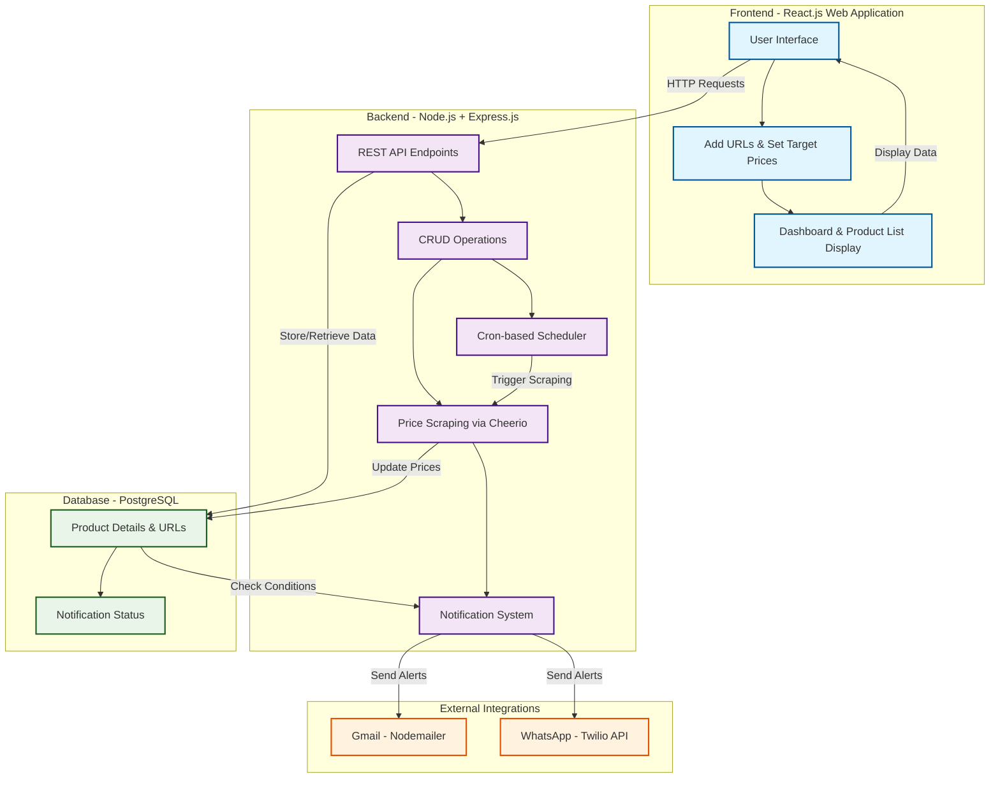

# Price Drop Detector

<p align="center">
  Stay updated on your favorite product prices and never overpay again.<br/>
  Get instant alerts via <b>Email</b> and <b>WhatsApp</b> whenever prices drop.
</p>

---

## 🧠 Understanding the Problem

In today’s e-commerce world, prices fluctuate frequently across online platforms such as **Amazon**, **Flipkart**, **Meesho**, **Westside**, and **H&M**.  
Manually tracking these price changes is time-consuming and inefficient.

**Problem Statement:**  
> Users often overpay for products due to lack of real-time price tracking across e-commerce sites.

**Goal:**  
> Build an automated system that continuously monitors product prices, detects drops below a target threshold, and instantly notifies users via **Email** and **WhatsApp**.

---

## 🏗️ Architecture Design

**Figure:** System Architecture Flow for Price Drop Detector  
This diagram illustrates the interaction between the **React Frontend**, **Node.js Backend**, **PostgreSQL Database**, and **External Integrations** (Email & WhatsApp).

---

## ⚙️ Functional Requirements

| Feature | Description |
|----------|-------------|
| **Product Tracking** | Users can add product URLs with target prices to monitor. |
| **Price Scraping** | Scrapes product info (name, image, price) using **Axios** and **Cheerio**. |
| **Scheduled Checks** | Price checks run periodically using **Node-Cron** (hourly by default). |
| **Notifications** | Sends alerts via **Email** (Nodemailer) and **WhatsApp** (Twilio API). |
| **Shortened URLs** | Generates unique short URLs for tracked products. |
| **Dashboard Metrics** | Provides statistics like total tracked products and potential savings. |
| **CRUD Operations** | Create, Read, Update, and Delete product tracking entries. |
| **Similar Product Suggestions** | Recommends related products for better purchase decisions. |

---

## 🚫 Non-Functional Requirements

| Requirement | Description |
|-------------|-------------|
| **Scalability** | Should efficiently handle many concurrent users and products. |
| **Reliability** | Scheduler and notifications must operate without failures. |
| **Performance** | API responses and scraping should complete within a few seconds. |
| **Security** | Sensitive credentials are secured via `.env` configuration. |
| **Maintainability** | Code is modular for easy updates and new integrations. |
| **Error Handling** | Implements retries, fallbacks, and structured error responses. |
| **Data Integrity** | PostgreSQL ensures consistency and durability of stored product data. |

---

## 🔌 Setup, APIs, and System Interfaces

### 🧩 Environment Variables (`.env`)

```bash
PORT=5000
DB_USER=your_postgres_user
DB_HOST=localhost
DB_NAME=pricedrop
DB_PASSWORD=your_postgres_password
DB_PORT=5432

EMAIL_USER=your_email@gmail.com
EMAIL_PASS=your_email_password

TWILIO_SID=your_twilio_sid
TWILIO_AUTH_TOKEN=your_twilio_auth_token
TWILIO_WHATSAPP_NUMBER=whatsapp:+14155238886
````

BASE_URL=[http://localhost:5000](http://localhost:5000)

---

## API Endpoints

| Method   | Endpoint                | Description                        |
| -------- | ----------------------- | ---------------------------------- |
| `POST`   | `/api/track-product`    | Add a product for price tracking   |
| `GET`    | `/api/products`         | Retrieve all tracked products      |
| `GET`    | `/api/product/:id`      | Get a specific product’s details   |
| `PUT`    | `/api/product/:id`      | Update target price                |
| `DELETE` | `/api/product/:id`      | Remove a tracked product           |
| `GET`    | `/api/dashboard`        | View analytics and dashboard stats |
| `POST`   | `/api/similar-products` | Fetch related/similar products     |
| `GET`    | `/s/:shortCode`         | Redirect shortened product URLs    |

---

## 🧠 System Interfaces

### 🖥️ User Interface

Built with **React.js**, the frontend allows users to:

* Add product URLs and set target prices
* View tracked products and compare price trends
* Access insights and savings statistics
* Manage or delete tracked products
* Receive instant feedback on price updates

---

### ⚙️ Backend Services

Developed using **Node.js + Express.js**, the backend handles automation and API operations.

**Core Responsibilities:**

* Manage CRUD operations
* Scrape product data from online stores
* Schedule automated price checks
* Send Email and WhatsApp alerts
* Store and update data in PostgreSQL

**Libraries Used:**

* `axios` – Fetch product pages
* `cheerio` – Parse HTML for product details
* `node-cron` – Schedule periodic checks
* `nodemailer` – Send Email alerts
* `twilio` – Send WhatsApp messages
* `pg` – PostgreSQL database connection

---

### 🌐 External Interfaces

| Service                | Purpose                              |
| ---------------------- | ------------------------------------ |
| **Twilio API**         | Send WhatsApp notifications          |
| **Nodemailer (Gmail)** | Deliver Email alerts instantly       |
| **Axios**              | Fetch product HTML data              |
| **Cheerio**            | Parse and extract structured content |
| **PostgreSQL**         | Store product and alert information  |

---

## 🔁 Workflow Summary

1. 🧩 **User Input** → User submits a product URL & target price.
2. 🕵️ **Scraping** → Axios + Cheerio extract product name, price, and image.
3. 🗄️ **Storage** → Product data saved in PostgreSQL.
4. ⏰ **Scheduler** → Node-Cron triggers periodic price checks.
5. ⚖️ **Comparison** → Current price vs. target price.
6. 📢 **Notification** → Sends alert via Email and WhatsApp.
7. 📊 **Dashboard** → Frontend displays tracked products and insights.

---

## 💻 Tech Stack

| Category            | Technology          |
| ------------------- | ------------------- |
| **Frontend**        | React.js            |
| **Backend**         | Node.js, Express.js |
| **Database**        | PostgreSQL          |
| **Scraping**        | Axios, Cheerio      |
| **Scheduler**       | Node-Cron           |
| **Notifications**   | Nodemailer, Twilio  |
| **Utilities**       | UUID, dotenv        |
| **Version Control** | Git, GitHub         |

---

## 🔑 Key Code Components

### 🧰 Scheduler

Uses **node-cron** to periodically check prices.

```js
cron.schedule('0 * * * *', async () => {
  console.log('Running hourly price check...');
});
```

---

### 🕵️ Scraper

Fetches product HTML and extracts data with **cheerio**.

```js
const response = await axios.get(productUrl);
const $ = cheerio.load(response.data);
const price = $('.product-price').text();
```

---

### 🧑‍💻 Developer Notes

* Retry mechanism for failed scraping (3 attempts).
* Graceful error handling for invalid URLs or missing data.
* WhatsApp API rate-limit control.
* Modular, environment-safe architecture for scalability.

---

<p align="center">
  <b>💸 Smart Price Tracking | Real-time Alerts | Maximum Savings</b>
</p>
