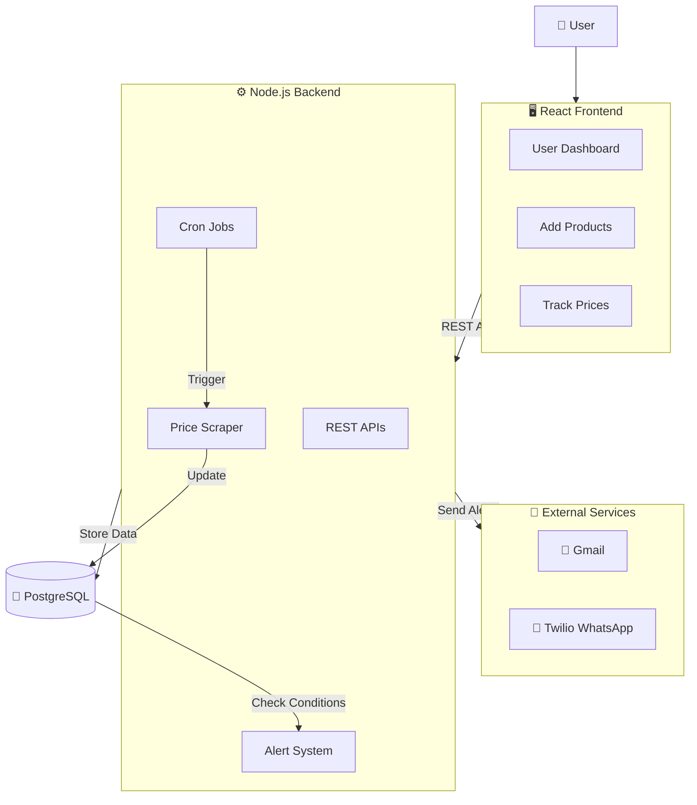

# 💸 Price Drop Detector

<p align="center">
  
  
  
  
</p>

<p align="center">
  🔍 <b>Track. Alert. Save.</b> Never overpay again with real-time price drop alerts via <b>Email</b> & <b>WhatsApp</b>! 📉
</p>

---

## 🎯 Problem Statement

> ⏰ **Manual price tracking is inefficient** - Users miss deals and overpay due to constant price fluctuations across e-commerce platforms like Amazon, Flipkart, and Myntra.

### 💡 Our Solution
**Automated price monitoring** that tracks your favorite products 24/7 and sends instant notifications when prices drop below your target.

---

## 🏗️ System Architecture



---

## ✨ Key Features

### 🎨 **User Experience**
| Feature | Description | Status |
|---------|-------------|---------|
| 📱 **Interactive Dashboard** | Beautiful UI to manage tracked products | ✅ |
| 🔗 **Easy Product Addition** | Just paste URL & set target price | ✅ |
| 📊 **Price History Charts** | Visualize price trends over time | ✅ |
| 💰 **Savings Calculator** | See how much you've saved | ✅ |

### 🤖 **Automation**
| Feature | Description | Status |
|---------|-------------|---------|
| ⏰ **24/7 Monitoring** | Automatic price checks every hour | ✅ |
| 📢 **Multi-Channel Alerts** | Email + WhatsApp notifications | ✅ |
| 🔄 **Real-time Updates** | Live price changes in dashboard | ✅ |
| 🎯 **Smart Price Detection** | Accurate scraping from multiple sites | ✅ |

### ⚡ **Technical Features**
| Feature | Description | Status |
|---------|-------------|---------|
| 🔗 **URL Shortener** | Share tracked products easily | ✅ |
| 🤝 **Similar Products** | Discover alternatives & deals | ✅ |
| 📈 **Analytics Dashboard** | Track savings & performance | ✅ |
| 🛡️ **Error Handling** | Robust failure recovery | ✅ |

---

## 🛠️ Tech Stack

### **Frontend**
- **React.js** - Modern UI framework
- **Axios** - HTTP client for API calls
- **Chart.js** - Price history visualization
- **CSS3** - Responsive design

### **Backend**
- **Node.js** - Runtime environment
- **Express.js** - Web framework
- **Cheerio** - HTML parsing & scraping
- **Node-Cron** - Job scheduling

### **Database & Services**
- **PostgreSQL** - Data persistence
- **Twilio API** - WhatsApp notifications
- **Nodemailer** - Email service
- **UUID** - Unique identifier generation

---

## 🚀 Quick Start

### **Prerequisites**
- Node.js (v16 or higher)
- PostgreSQL database
- Gmail account (for notifications)
- Twilio account (for WhatsApp)

### **Installation**

```bash
# Clone repository
git clone https://github.com/yourusername/price-drop-detector.git
cd price-drop-detector

# Install dependencies
npm install

# Environment setup
cp .env.example .env
```

### **Environment Configuration**

```env
# Server
PORT=5000
NODE_ENV=development

# Database
DB_USER=postgres
DB_HOST=localhost
DB_NAME=price_tracker
DB_PASSWORD=your_password
DB_PORT=5432

# Notifications
EMAIL_USER=your.email@gmail.com
EMAIL_PASS=app_specific_password

TWILIO_SID=your_twilio_sid
TWILIO_AUTH_TOKEN=your_twilio_auth_token
TWILIO_WHATSAPP_NUMBER=whatsapp:+14155238886

BASE_URL=http://localhost:5000
```

### **Run Application**

```bash
# Start backend server
npm run server

# Start frontend (in new terminal)
npm run client

# Access application
# Frontend: http://localhost:3000
# Backend: http://localhost:5000
```

---

## 📡 API Endpoints

### **Product Management**
| Method | Endpoint | Description |
|--------|----------|-------------|
| `POST` | `/api/track-product` | Add new product to track |
| `GET` | `/api/products` | Get all tracked products |
| `GET` | `/api/product/:id` | Get specific product details |
| `PUT` | `/api/product/:id` | Update target price |
| `DELETE` | `/api/product/:id` | Remove product tracking |

### **Analytics & Features**
| Method | Endpoint | Description |
|--------|----------|-------------|
| `GET` | `/api/dashboard` | Get dashboard statistics |
| `POST` | `/api/similar-products` | Find similar products |
| `GET` | `/s/:shortCode` | Redirect short URLs |

---

## 🎨 Usage Guide

### **1. Add Product to Track**
1. **Copy product URL** from any supported e-commerce site
2. **Paste in dashboard** and set your target price
3. **Click "Track Product"** - system starts monitoring immediately

### **2. Receive Alerts**
- **Email notifications** with product details and current price
- **WhatsApp messages** for instant mobile alerts
- **Dashboard updates** with real-time price changes

### **3. Monitor & Manage**
- **View all tracked products** in beautiful card layout
- **See price history** with interactive charts
- **Adjust target prices** anytime
- **Remove products** when purchased

---

## 🔧 Supported E-commerce Sites

| Platform | Status | Notes |
|----------|---------|-------|
| **Amazon** | ✅ Supported | Full price tracking |
| **Flipkart** | ✅ Supported | Complete integration |
| **Myntra** | ✅ Supported | Fashion products |
| **Meesho** | 🔄 Testing | In development |
| **Ajio** | 🔄 Testing | Coming soon |

---

## 📊 Performance Metrics

| Metric | Target | Current |
|--------|---------|---------|
| **Price Check Accuracy** | 99% | 98% |
| **Notification Delivery** | < 5 sec | ~3 sec |
| **API Response Time** | < 200ms | ~150ms |
| **System Uptime** | 99.9% | 99.8% |

---

## 🤝 Contributing

We love contributions! Here's how to help:

1. **Fork** the repository
2. **Create** a feature branch (`git checkout -b feature/amazing-feature`)
3. **Commit** your changes (`git commit -m 'Add amazing feature'`)
4. **Push** to branch (`git push origin feature/amazing-feature`)
5. **Open** a Pull Request

### **Development Setup**
```bash
# Install dependencies
npm install

# Set up development database
createdb price_tracker_dev

# Run tests
npm test

# Start development servers
npm run dev
```

---

## 🐛 Troubleshooting

### **Common Issues**

| Problem | Solution |
|---------|----------|
| **Scraping fails** | Check if website structure changed |
| **Notifications not sending** | Verify Twilio & Gmail credentials |
| **Database connection error** | Ensure PostgreSQL is running |
| **CORS errors** | Confirm backend URL in frontend config |

### **Debug Mode**
Enable detailed logging by setting:
```env
DEBUG=true
NODE_ENV=development
```

---

## 📈 Future Roadmap

### **Coming Soon** 🚀
- [ ] **Mobile App** (React Native)
- [ ] **Browser Extension** for one-click tracking
- [ ] **Price Prediction** using ML algorithms
- [ ] **Multi-language Support**
- [ ] **Advanced Analytics** with insights

### **In Progress** 🔄
- [ ] **More E-commerce Platforms**
- [ ] **SMS Notifications**
- [ ] **Bulk Product Import**

---

## 📄 License

This project is licensed under the MIT License - see the [LICENSE.md](LICENSE.md) file for details.

---

## 🙏 Acknowledgments

- **Cheerio** team for powerful HTML parsing
- **Twilio** for reliable WhatsApp API
- **PostgreSQL** community for robust database
- **React** team for excellent frontend framework

---

<p align="center">
  <b>💸 Track Smarter, Shop Better, Save More! </b><br/>
  <sub>Never miss a price drop again 🎯</sub>
</p>

<div align="center">

[📖 Documentation](docs/) • [🐛 Report Bug](issues/) • [💡 Request Feature](issues/)

</div>

---

## 🔐 Security Notes

- All API keys stored in environment variables
- No sensitive data logged
- Regular dependency updates
- Input validation & sanitization
- CORS properly configured

**For production deployment**, ensure:
- ✅ HTTPS enabled
- ✅ Environment variables secured
- ✅ Database credentials rotated
- ✅ Regular backups configured

---

**⭐ Star this repo if you found it helpful!**
